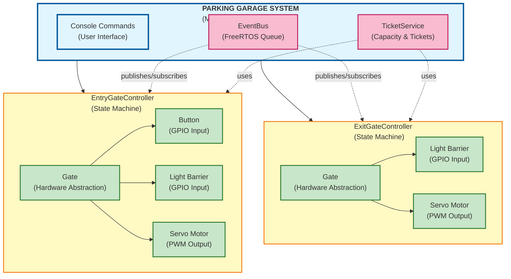
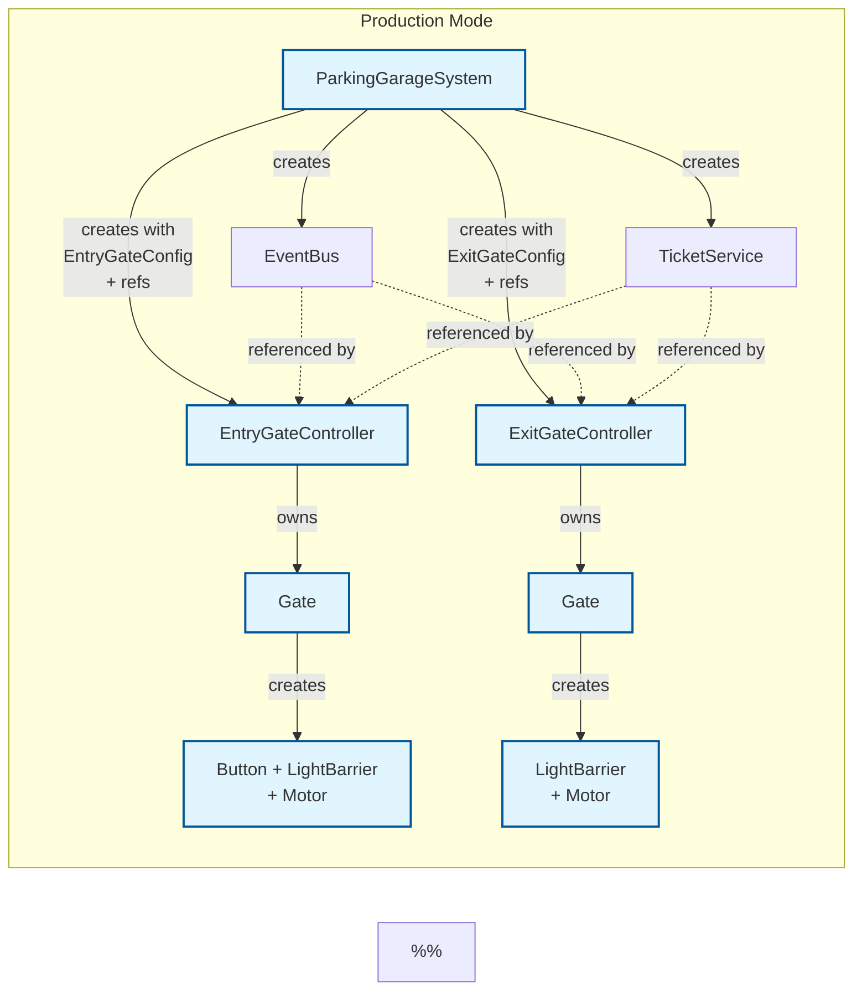
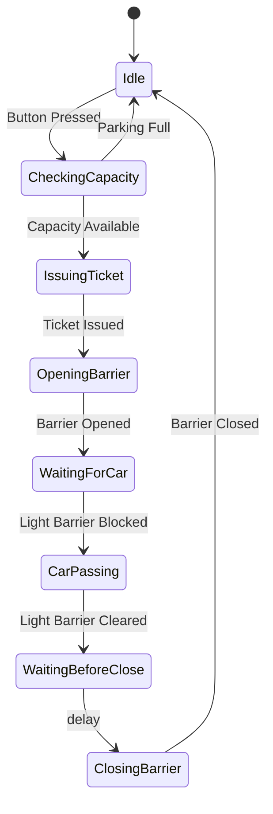
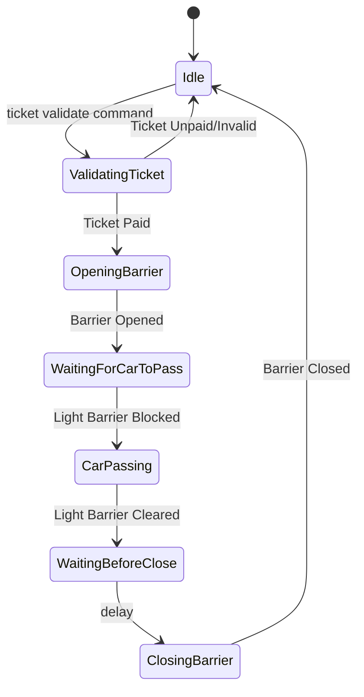

# Parking Garage Control System

Event-driven parking garage control system for ESP32 using ESP-IDF and FreeRTOS.


[](https://github.com/0xfischer/parking_garage_control_system/releases)

## Features

- **Event-Driven Architecture**: GPIO interrupts trigger events processed by state machines
- **Hardware Abstraction Layer**: Testable design with mock implementations
- **State Machines**: Entry and exit gate controllers with well-defined states
- **Ticket System**: Complete ticket lifecycle management (issue, pay, validate)
- **ESP Console**: Interactive command-line interface for monitoring and control
- **Configurable**: GPIO pins and capacity configurable via Kconfig
- **Thread-Safe**: FreeRTOS mutex and queue protection

## Demo


## Quick Start

### Prerequisites

- ESP-IDF v5.5 or later
- ESP32 development board

### Build and Flash

```bash
# Set up ESP-IDF environment
. $IDF_PATH/export.sh

# Build
idf.py build

# Flash and monitor
idf.py -p /dev/ttyUSB0 flash monitor
```

### Configuration

Use `idf.py menuconfig` to configure:
- **GPIO pins**: "Parking Garage Control System Configuration" → "GPIO Configuration"
- **Capacity**: Choose Test Mode (5 spaces) or Production Mode (2000 spaces)
- **Timings**: Barrier timeout, button debounce

## Hardware Configuration

Default GPIO assignment:

| Component | GPIO | Type | Notes |
|-----------|------|------|-------|
| Entry Button | 25 | Input | Active low, internal pull-up |
| Entry Light Barrier | 23 | Input | LOW = car detected |
| Entry Barrier Servo | 22 | PWM | LEDC Channel 0 |
| Exit Light Barrier | 4 | Input | LOW = car detected |
| Exit Barrier Servo | 2 | PWM | LEDC Channel 1 |

### Servo Motors

The barrier gates use servo motors with PWM signals:
- **Frequency**: 50Hz (standard servo)
- **Closed (90°)**: 1.5ms pulse - Barrier vertical
- **Open (0°)**: 1ms pulse - Barrier horizontal
- **PWM Generation**: ESP32 LEDC with 14-bit resolution

## Architecture

### System Overview



### Ownership & Construction Flow



### Key Design Principles

- **Config-Based Construction**: Controllers accept config structs with all GPIO pins and settings
- **Ownership Hierarchy**: Controllers own their Gate hardware (Button, LightBarrier, Motor)
- **Clean Separation**: ParkingGarageSystem manages only controllers and services, not low-level GPIO
- **Dual Constructors**: Production mode creates hardware, test mode accepts mocks
- **Interrupt Setup**: Controllers configure their own GPIO interrupts via `setupGpioInterrupts()`

### State Machines

#### Entry Gate


**Events**:
- `EntryButtonPressed` → Trigger capacity check
- `CapacityFull` → Reject entry
- `TicketIssued` → Allow entry
- `EntryLightBarrierBlocked` → Car detected
- `EntryLightBarrierCleared` → Car passed
- `BarrierTimeout` → Barrier movement complete

#### Exit Gate


**States**:
- **Idle**: Waiting for manual ticket validation command
- **ValidatingTicket**: Checking ticket payment status
- **OpeningBarrier**: Motor opening barrier (HIGH)
- **WaitingForCarToPass**: Barrier open, waiting for vehicle
- **CarPassing**: Vehicle passing through light barrier
- **WaitingBeforeClose**: 2-second safety delay after car exited
- **ClosingBarrier**: Motor closing barrier (LOW)

## Console Commands
Available commands in the ESP console:
```
=== Parking Garage Control System ===

Available Commands:
  status                    - Show system status
  ticket list               - List all tickets
  ticket pay <id>           - Pay ticket
  ticket validate <id>      - Validate ticket for exit
  publish <event>           - Publish event (use 'list')
  gpio                      - GPIO read/write
  test <entry|exit|full>    - Hardware test guides
  help                      - Show help
  restart                   - Restart system
```

### GPIO Control

```bash
# Read states
gpio read entry button      # Read entry button (GPIO 25)
gpio read entry barrier     # Read entry light barrier (GPIO 23)
gpio read exit barrier      # Read exit light barrier (GPIO 4)

# Control motors
gpio write entry motor open   # Open entry barrier
gpio write entry motor close  # Close entry barrier
gpio write exit motor open    # Open exit barrier
gpio write exit motor close   # Close exit barrier

# Simulate inputs (via events)
gpio write entry button pressed      # Simulate button press
gpio write entry barrier blocked     # Simulate car at entry
gpio write entry barrier cleared     # Simulate car passed entry
gpio write exit barrier blocked      # Simulate car at exit
gpio write exit barrier cleared      # Simulate car passed exit
```

### Example: Complete Entry/Exit Flow

```bash
publish EntryButtonPressed           # Ticket #1 created, barrier opens
publish EntryLightBarrierBlocked     # Car detected
publish EntryLightBarrierCleared     # Car passed, barrier closes
ticket pay 1                         # Pay ticket
ticket validate 1                    # Validate ticket, exit barrier opens
publish ExitLightBarrierBlocked      # Car exiting
publish ExitLightBarrierCleared      # Car exited, barrier closes
```

## Testing

| Type | Location | Runs On | Purpose |
|------|----------|---------|---------|
| **Host Tests** | `test/unit-tests/` | PC (g++) | Fast logic tests with mocks |
| **Unity HW Tests** | `test/unity-hw-tests/` | ESP32/Wokwi | Hardware integration tests |
| **Wokwi Simulation** | `test/wokwi-tests/` | Wokwi CI | Full system simulation |

### Run Tests

```bash
# Host tests (fast, no hardware needed)
make test-host

# Host tests with coverage
make coverage-run
open build-host/coverage.html

# Unity hardware tests (requires ESP32 or Wokwi)
make test-unity-wokwi

# Wokwi simulation tests
idf.py -DSDKCONFIG_DEFAULTS="sdkconfig.defaults;sdkconfig.ci" build 
or
make build-ci

export WOKWI_CLI_TOKEN=wok_xxx
wokwi-cli --scenario test/wokwi-tests/console_full.yaml
```

For detailed test documentation, see [test/README.md](test/README.md).

## CI/CD Workflows

| Workflow | Trigger | Description |
|----------|---------|-------------|
| **Build** | Push/PR | Build firmware with ESP-IDF |
| **Host Tests** | Push/PR | Run unit tests with coverage |
| **Unity HW Tests** | Push/PR | Run hardware tests on Wokwi |
| **Wokwi Tests** | Manual | Full simulation tests |
| **Format** | Push/PR | Check code formatting |
| **Tidy** | Manual | Run clang-tidy analysis |
| **Docs** | Push to main | Generate and deploy Doxygen docs |
| **Release** | Tag `vX.Y.Z` | Create release with artifacts |

> Tip: For local GitHub Actions testing, see `ACT.md`.

## Documentation

- Generated via Doxygen and deployed to GitHub Pages
- Link: https://0xfischer.github.io/parking_garage_control_system/

## Devcontainer

A devcontainer image with all tools is available:

```bash
# Push to GHCR
GITHUB_TOKEN=ghp_xxx tools/release_devcontainer_to_github.sh

# With tag
GITHUB_TOKEN=ghp_xxx tools/release_devcontainer_to_github.sh --tag v5.5

tools/release_devcontainer_to_github.sh --tag v5.2.2 --image ghcr.io/0xfischer/parking_garage_control_system-dev:latest
```

## Project Structure

```
parking_garage_control_system/
├── components/parking_system/
│   ├── include/
│   │   ├── events/       # IEventBus, FreeRtosEventBus
│   │   ├── gates/        # Gate controllers & abstractions
│   │   ├── hal/          # Hardware Abstraction Layer
│   │   ├── tickets/      # Ticket service
│   │   └── parking/      # Main orchestrator
│   └── src/              # Implementation files
├── main/
│   ├── main.cpp          # Application entry point
│   └── console_commands.cpp
├── test/
│   ├── unit-tests/       # Host unit tests
│   ├── unity-hw-tests/   # ESP32 hardware tests
│   ├── wokwi-tests/      # Wokwi simulation scenarios
│   └── mocks/            # Mock implementations
├── examples/
│   ├── hal_state_machine/
│   └── event_driven_state_machine/
└── .github/workflows/    # CI/CD pipelines
```

## Lint & Format

- **clang-format**: Code formatting (configured in `.clang-format`)
- **clang-tidy**: Static analysis (configured in `.clang-tidy`)

```bash
# Format code
make format
make format-check
make format-changed

# Run clang-tidy (requires compile_commands.json)
make lint-tidy
make lint-tidy-changed
```

Git hooks:
- `pre-commit`: Checks formatting on staged files
- `pre-push`: Optional clang-tidy (`ENABLE_TIDY=1 git push`)

## License

MIT License

## Author

Eugen Fischer

Created with Claude Code
