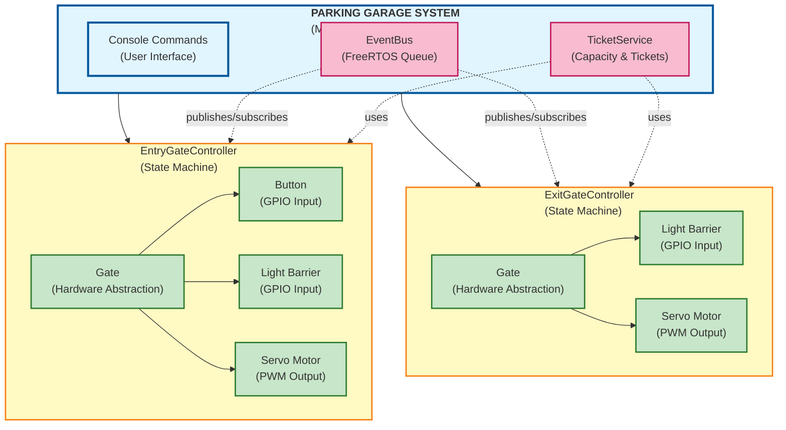
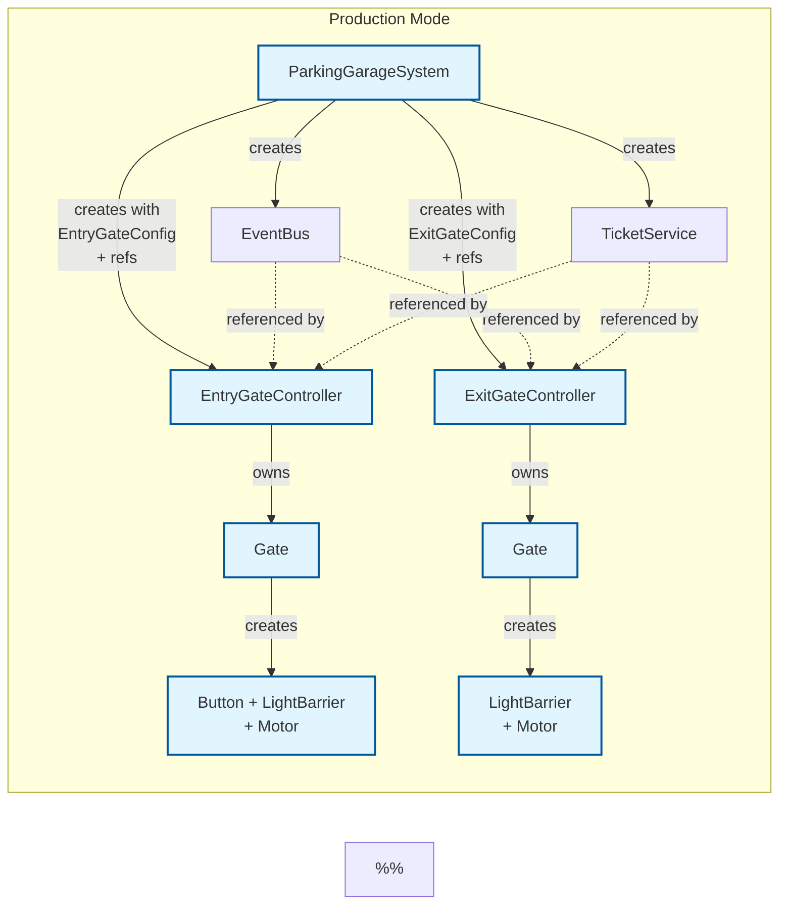
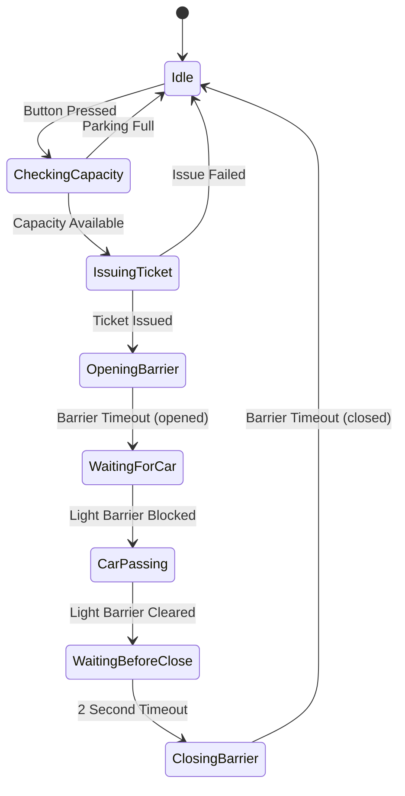
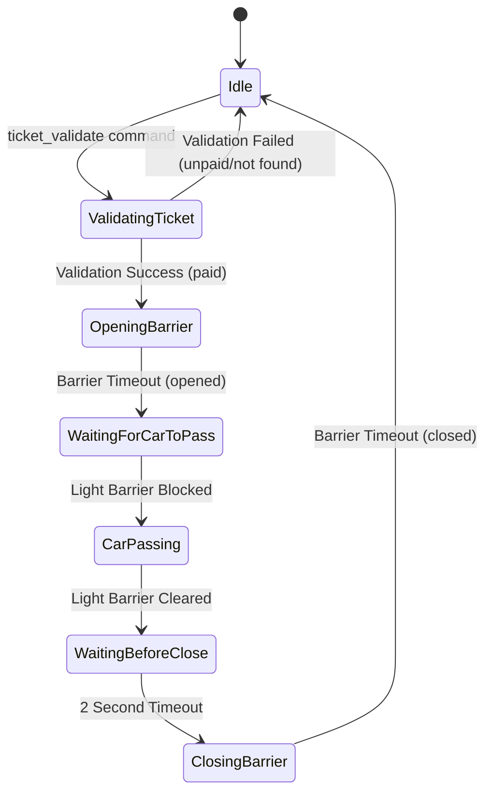

# Parking Garage Control System

Event-driven parking garage control system for ESP32 using ESP-IDF and FreeRTOS.

## Features

- **Event-Driven Architecture**: GPIO interrupts trigger events processed by state machines
- **Hardware Abstraction Layer**: Testable design with mock implementations
- **State Machines**: Entry and exit gate controllers with well-defined states
- **Ticket System**: Complete ticket lifecycle management (issue, pay, validate)
- **ESP Console**: Interactive command-line interface for monitoring and control
- **Configurable**: GPIO pins and capacity configurable via Kconfig
- **Thread-Safe**: FreeRTOS mutex and queue protection

## Hardware Configuration

Default GPIO assignment:
- **GPIO 25**: Entry Button (with internal pull-up)
- **GPIO 23**: Entry Light Barrier (with internal pull-up)
- **GPIO 22**: Entry Barrier Servo (PWM via LEDC Channel 0)
- **GPIO 4**: Exit Light Barrier (with internal pull-up)
- **GPIO 2**: Exit Barrier Servo (PWM via LEDC Channel 1)

### Servo Motors
The barrier gates are controlled by servo motors using PWM signals:
- **Frequency**: 50Hz (standard servo)
- **Closed Position (90°)**: 1.5ms pulse width (LOW state) - Barrier vertical
- **Open Position (0°)**: 1ms pulse width (HIGH state) - Barrier horizontal
- **PWM Generation**: ESP32 LEDC (LED Controller) with 14-bit resolution

## Architecture

### System Overview



### Ownership & Construction Flow



**Key Design Principles:**

- **Config-Based Construction**: Controllers accept config structs with all GPIO pins and settings
- **Ownership Hierarchy**: Controllers own their Gate hardware (Button, LightBarrier, Motor)
- **Clean Separation**: ParkingGarageSystem doesn't manage low-level GPIO - only controllers and services
- **Dual Constructors**: Production mode creates hardware, test mode accepts mocks
- **Interrupt Setup**: Controllers configure their own GPIO interrupts via `setupGpioInterrupts()`

### State Machines

#### Entry Gate State Machine



**States**:
- **Idle**: Waiting for entry button press
- **CheckingCapacity**: Verifying parking availability
- **IssuingTicket**: Creating new ticket for driver
- **OpeningBarrier**: Motor opening barrier (HIGH)
- **WaitingForCar**: Barrier open, waiting for vehicle
- **CarPassing**: Vehicle passing through light barrier
- **WaitingBeforeClose**: 2-second safety delay after car passed
- **ClosingBarrier**: Motor closing barrier (LOW)

**Events**:
- `EntryButtonPressed` → Trigger capacity check
- `CapacityFull` → Reject entry
- `TicketIssued` → Allow entry
- `EntryLightBarrierBlocked` → Car detected
- `EntryLightBarrierCleared` → Car passed
- `BarrierTimeout` → Barrier movement complete

#### Exit Gate State Machine



**States**:
- **Idle**: Waiting for manual ticket validation command
- **ValidatingTicket**: Checking ticket payment status
- **OpeningBarrier**: Motor opening barrier (HIGH)
- **WaitingForCarToPass**: Barrier open, waiting for vehicle
- **CarPassing**: Vehicle passing through light barrier
- **WaitingBeforeClose**: 2-second safety delay after car exited
- **ClosingBarrier**: Motor closing barrier (LOW)

**Events/Commands**:
- `ticket_validate <id>` → Start validation (manual command)
- `TicketValidated` → Ticket is paid, proceed
- `TicketRejected` → Ticket unpaid or invalid, deny exit
- `ExitLightBarrierBlocked` → Car enters barrier area
- `ExitLightBarrierCleared` → Car exited
- `BarrierTimeout` → Barrier movement complete

## Build and Flash

### Prerequisites

- ESP-IDF v5.0 or later
- ESP32 development board

### Build

```bash
# Set up ESP-IDF environment
. $IDF_PATH/export.sh

# Configure project (optional)
idf.py menuconfig

# Build
idf.py build

# Flash
idf.py -p /dev/ttyUSB0 flash monitor
```

### Configuration

Use `idf.py menuconfig` to configure:
- **GPIO pins**: "Parking Garage Control System Configuration" → "GPIO Configuration"
- **Capacity**: Choose Test Mode (5 spaces) or Production Mode (2000 spaces)
- **Timings**: Barrier timeout, button debounce
  - **Safety Delay**: 2-second wait after car passes before closing barrier (hardcoded)

## Demo


## Console Commands

Available commands in the ESP console:

```
=== Parking Garage Control System ===

Available Commands:
  status                    - Show system status
  ticket list               - List all tickets
  ticket pay <id>           - Pay ticket
  ticket validate <id>      - Validate ticket for exit
  publish <event>           - Publish event (use 'list')
  gpio                      - GPIO read/write (use for usage)
  test <entry|exit|full|info>  - Hardware test guides
  ?                         - Show this help
  help                      - Show ESP-IDF help
  clear                     - Clear screen
  restart                   - Restart system
```

### GPIO Control

The `gpio` command allows direct hardware access and simulation:

```bash
# Read GPIO states
ParkingGarage> gpio read entry button    # Read entry button (GPIO 25)
ParkingGarage> gpio read entry barrier   # Read entry light barrier (GPIO 23)
ParkingGarage> gpio read exit barrier    # Read exit light barrier (GPIO 4)

# Control barrier motors (direct hardware)
ParkingGarage> gpio write entry motor open   # Open entry barrier (GPIO 22)
ParkingGarage> gpio write entry motor close  # Close entry barrier
ParkingGarage> gpio write exit motor open    # Open exit barrier (GPIO 2)
ParkingGarage> gpio write exit motor close   # Close exit barrier

# Simulate inputs (via events)
ParkingGarage> gpio write entry button pressed     # Simulate button press
ParkingGarage> gpio write entry barrier blocked    # Simulate car blocking entry
ParkingGarage> gpio write entry barrier cleared    # Simulate car passing entry
ParkingGarage> gpio write exit barrier blocked     # Simulate car blocking exit
ParkingGarage> gpio write exit barrier cleared     # Simulate car passing exit
```

### Event Publishing

The `publish` command allows you to trigger events directly:

```bash
# List all available events
ParkingGarage> publish list

=== Available Events ===

Entry Gate Events:
  EntryButtonPressed        - Simulate entry button press
  EntryLightBarrierBlocked  - Block entry light barrier
  EntryLightBarrierCleared  - Clear entry light barrier

Exit Gate Events:
  ExitLightBarrierBlocked   - Block exit light barrier
  ExitLightBarrierCleared   - Clear exit light barrier

# Publish a specific event
ParkingGarage> publish EntryButtonPressed
Publishing event: EntryButtonPressed
```

### Example Usage

📖 **Detaillierte Console-Workflow Beispiele:** [examples/README.md](examples/README.md#-console-workflow-examples)

**Kurzbeispiel - Vollständiger Entry/Exit Flow:**
```bash
ParkingGarage> publish EntryButtonPressed     # Ticket #1 wird erstellt, Schranke öffnet
ParkingGarage> ticket pay 1                   # Ticket bezahlen
ParkingGarage> ticket validate 1              # Ticket validieren, Ausfahrt-Schranke öffnet
ParkingGarage> publish ExitLightBarrierBlocked  # Auto fährt aus
```

## Testing

📖 **Vollständige Test-Dokumentation:** [test/README.md](test/README.md)

### Kurzübersicht

| Typ | Ort | Läuft auf | Zweck |
|-----|-----|-----------|-------|
| **Unit Tests (Mocks)** | `test/*.cpp` | Host (PC) | Schnelle Logik-Tests |
| **Wokwi Simulation** | `test/wokwi/*.yaml` | Wokwi CI | Hardware-Simulation |
| **Unity HW Tests** | `components/parking_system/test/` | ESP32 | Echte Hardware |

### Schnellstart

```bash
# Unit Tests bauen und ausführen (< 1 Sekunde)
./test/bin_test_entry_gate
./test/bin_test_exit_gate

# Wokwi Simulation
```bash
# Run all Wokwi CLI tests
idf.py build 
export WOKWI_CLI_TOKEN=wok_xxx
wokwi-cli --scenario test/wokwi/console_full.yaml
wokwi-cli --scenario test/wokwi/entry_exit_flow.yaml
wokwi-cli --scenario test/wokwi/full_capacity.yaml
```

# Hardware Tests
idf.py -T parking_system build && idf.py flash monitor
```

## State Machine Examples

📖 **Vollständige Beispiel-Dokumentation:** [examples/README.md](examples/README.md)

Dieses Projekt enthält zwei State Machine Implementierungen:

| Pattern | Beschreibung | Best for |
|---------|--------------|----------|
| **HAL State Machine** | Interface-basiert, Dependency Injection | Einfache Systeme |
| **Event-Driven** | Publisher-Subscriber, Zero Hardware Dependencies | Komplexe Systeme |

**Quick Start:**
```bash
# HAL State Machine
cd examples/hal_state_machine && g++ -std=c++20 *.cpp -o hal_example && ./hal_example

# Event-Driven State Machine
cd examples/event_driven_state_machine && g++ -std=c++20 *.cpp -o event_example && ./event_example
```

## Project Structure

```
parking_garage_control_system/
├── components/
│   └── parking_system/           # Main component
│       ├── include/
│       │   ├── events/           # Event system (IEventBus, FreeRtosEventBus)
│       │   ├── gates/            # Gate controllers & abstractions
│       │   │   ├── EntryGateController.h    # Entry gate FSM + config
│       │   │   ├── ExitGateController.h     # Exit gate FSM + config
│       │   │   ├── Gate.h                   # Owns Button/LightBarrier/Motor
│       │   │   └── IGate.h                  # Gate interface
│       │   ├── hal/              # Hardware Abstraction Layer
│       │   │   ├── IGpioInput.h            # Input interface
│       │   │   ├── IGpioOutput.h           # Output interface
│       │   │   ├── EspGpioInput.h          # ESP32 GPIO input
│       │   │   └── EspServoOutput.h        # ESP32 servo control
│       │   ├── tickets/          # Ticket service
│       │   └── parking/          # Main orchestrator
│       │       └── ParkingGarageSystem.h   # Creates controllers & services
│       └── src/                  # Implementation files
├── test/
│   ├── mocks/                    # Mock implementations
│   │   ├── MockGate.h            # Gate mock
│   │   ├── MockGpioInput.h       # GPIO input mock
│   │   ├── MockEventBus.h        # Event bus mock
│   │   └── MockTicketService.h   # Ticket service mock
│   ├── stubs/                    # FreeRTOS/ESP-IDF stubs for PC builds
│   │   ├── freertos/             # FreeRTOS headers
│   │   └── driver/               # ESP driver headers
│   ├── test_entry_gate.cpp       # Entry gate unit tests (4 tests)
│   └── test_exit_gate.cpp        # Exit gate unit tests (4 tests)
├── main/
│   ├── main.cpp                  # Application entry point
│   ├── console_commands.cpp      # Console command handlers
│   └── Kconfig.projbuild         # Configuration menu
├── examples/
│   ├── hal_state_machine/        # Simple HAL pattern example
│   └── event_driven_state_machine/  # Advanced event-driven pattern
└── CMakeLists.txt
```

### Key Files

**Production Code:**
- [ParkingGarageSystem.cpp](components/parking_system/src/parking/ParkingGarageSystem.cpp) - Main orchestrator, creates controllers with config structs
- [EntryGateController.cpp](components/parking_system/src/gates/EntryGateController.cpp) - Entry gate FSM, owns Gate hardware
- [ExitGateController.cpp](components/parking_system/src/gates/ExitGateController.cpp) - Exit gate FSM, owns Gate hardware
- [Gate.cpp](components/parking_system/src/gates/Gate.cpp) - Gate abstraction (Button, LightBarrier, Motor)

**Test Code:**
- [test_entry_gate.cpp](test/test_entry_gate.cpp) - Entry gate tests using mocks
- [test_exit_gate.cpp](test/test_exit_gate.cpp) - Exit gate tests using mocks
- [MockGate.h](test/mocks/MockGate.h) - Gate mock for testing


## License

MIT License

## Author
Eugen Fischer

Created with Claude Code
