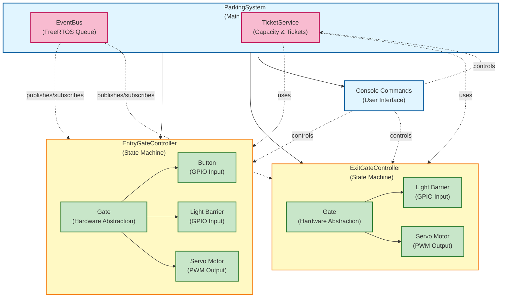
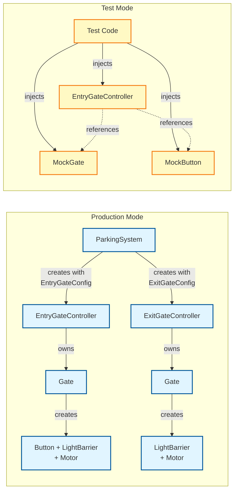
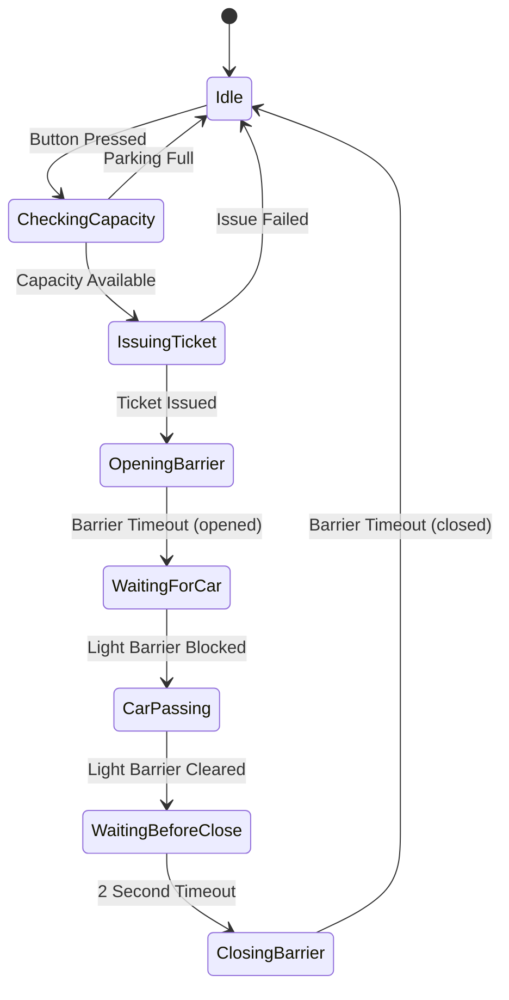
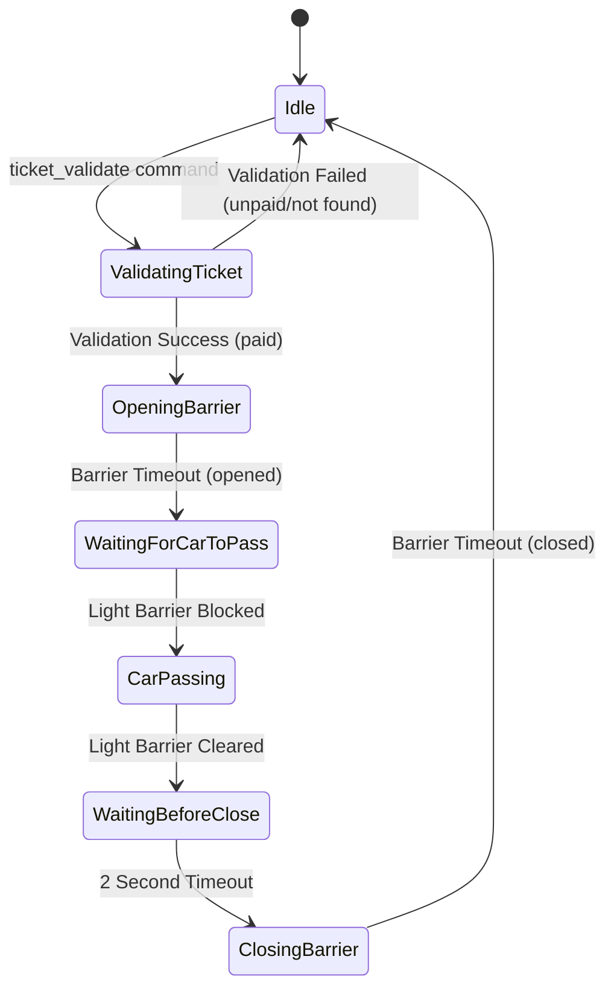
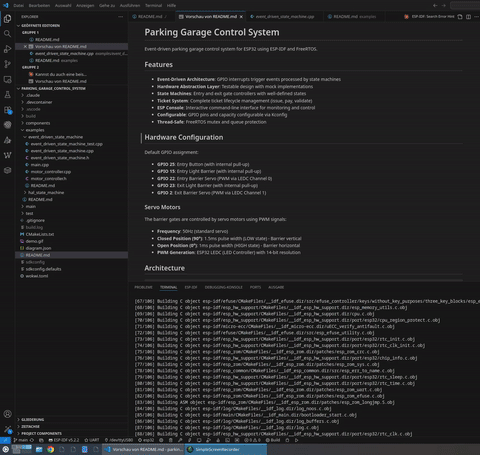

# Parking Garage Control System

Event-driven parking garage control system for ESP32 using ESP-IDF and FreeRTOS.

## Features

- **Event-Driven Architecture**: GPIO interrupts trigger events processed by state machines
- **Hardware Abstraction Layer**: Testable design with mock implementations
- **State Machines**: Entry and exit gate controllers with well-defined states
- **Ticket System**: Complete ticket lifecycle management (issue, pay, validate)
- **ESP Console**: Interactive command-line interface for monitoring and control
- **Configurable**: GPIO pins and capacity configurable via Kconfig
- **Thread-Safe**: FreeRTOS mutex and queue protection

## Hardware Configuration

Default GPIO assignment:
- **GPIO 25**: Entry Button (with internal pull-up)
- **GPIO 15**: Entry Light Barrier (with internal pull-up)
- **GPIO 22**: Entry Barrier Servo (PWM via LEDC Channel 0)
- **GPIO 23**: Exit Light Barrier (with internal pull-up)
- **GPIO 2**: Exit Barrier Servo (PWM via LEDC Channel 1)

### Servo Motors
The barrier gates are controlled by servo motors using PWM signals:
- **Frequency**: 50Hz (standard servo)
- **Closed Position (90°)**: 1.5ms pulse width (LOW state) - Barrier vertical
- **Open Position (0°)**: 1ms pulse width (HIGH state) - Barrier horizontal
- **PWM Generation**: ESP32 LEDC (LED Controller) with 14-bit resolution

## Architecture

### System Overview



### Ownership & Construction Flow



**Key Design Principles:**

- **Config-Based Construction**: Controllers accept config structs with all GPIO pins and settings
- **Ownership Hierarchy**: Controllers own their Gate hardware (Button, LightBarrier, Motor)
- **Clean Separation**: ParkingSystem doesn't manage low-level GPIO - only controllers and services
- **Dual Constructors**: Production mode creates hardware, test mode accepts mocks
- **Interrupt Setup**: Controllers configure their own GPIO interrupts via `setupGpioInterrupts()`

### State Machines

#### Entry Gate State Machine



**States**:
- **Idle**: Waiting for entry button press
- **CheckingCapacity**: Verifying parking availability
- **IssuingTicket**: Creating new ticket for driver
- **OpeningBarrier**: Motor opening barrier (HIGH)
- **WaitingForCar**: Barrier open, waiting for vehicle
- **CarPassing**: Vehicle passing through light barrier
- **WaitingBeforeClose**: 2-second safety delay after car passed
- **ClosingBarrier**: Motor closing barrier (LOW)

**Events**:
- `EntryButtonPressed` → Trigger capacity check
- `CapacityFull` → Reject entry
- `TicketIssued` → Allow entry
- `EntryLightBarrierBlocked` → Car detected
- `EntryLightBarrierCleared` → Car passed
- `BarrierTimeout` → Barrier movement complete

#### Exit Gate State Machine



**States**:
- **Idle**: Waiting for manual ticket validation command
- **ValidatingTicket**: Checking ticket payment status
- **OpeningBarrier**: Motor opening barrier (HIGH)
- **WaitingForCarToPass**: Barrier open, waiting for vehicle
- **CarPassing**: Vehicle passing through light barrier
- **WaitingBeforeClose**: 2-second safety delay after car exited
- **ClosingBarrier**: Motor closing barrier (LOW)

**Events/Commands**:
- `ticket_validate <id>` → Start validation (manual command)
- `TicketValidated` → Ticket is paid, proceed
- `TicketRejected` → Ticket unpaid or invalid, deny exit
- `ExitLightBarrierBlocked` → Car enters barrier area
- `ExitLightBarrierCleared` → Car exited
- `BarrierTimeout` → Barrier movement complete

## Build and Flash

### Prerequisites

- ESP-IDF v5.0 or later
- ESP32 development board

### Build

```bash
# Set up ESP-IDF environment
. $IDF_PATH/export.sh

# Configure project (optional)
idf.py menuconfig

# Build
idf.py build

# Flash
idf.py -p /dev/ttyUSB0 flash monitor
```

### Configuration

Use `idf.py menuconfig` to configure:
- **GPIO pins**: "Parking Garage Control System Configuration" → "GPIO Configuration"
- **Capacity**: Choose Test Mode (5 spaces) or Production Mode (2000 spaces)
- **Timings**: Barrier timeout, button debounce
  - **Safety Delay**: 2-second wait after car passes before closing barrier (hardcoded)

## Demo


## Console Commands

Available commands in the ESP console:

```
=== Parking Garage Control System ===

  status                    - Show system status
  ticket_list               - List all tickets
  ticket_pay <id>           - Pay ticket
  ticket_validate <id>      - Validate ticket for exit
  gpio_read <gate> <dev>    - Read GPIO state
  simulate_entry            - Simulate entry button press
  simulate_exit             - Simulate car at exit
  ?                         - Show this help
  help                      - Show ESP-IDF help
  clear                     - Clear screen
  restart                   - Restart system
```

### Example Usage

#### Vollständiger Entry/Exit Workflow über Console

Hier ist ein kompletter Durchlauf von Einfahrt bis Ausfahrt. **Wichtig**: Die Schranke öffnet nur bei bezahlten Tickets!

**1. System Status prüfen**
```
parking> status
=== Parking System Status ===
Capacity: 0/5 (5 free)
Entry Gate: Idle
Exit Gate: Idle
Active Tickets: 0
```

**2. Einfahrt simulieren**
```
parking> simulate_entry
Simulating entry button press...
I (1234) EntryGateController: Ticket issued: ID=1
I (1235) EntryGateController: State: Idle -> OpeningBarrier
```
Die State Machine durchläuft automatisch:
Idle → CheckingCapacity → IssuingTicket → OpeningBarrier → WaitingForCar → CarPassing → WaitingBeforeClose (2 Sek) → ClosingBarrier → Idle

**3. Ticket anzeigen lassen**
```
parking> ticket_list
=== Ticket System ===
Active Tickets: 1
Capacity: 5
Available Spaces: 4

Active Tickets:
  Ticket #1: UNPAID (Entry: 2025-12-04 14:23:15)
```

**4. Ticket validieren OHNE Bezahlung**
```
parking> ticket_validate 1
I (5678) ExitGateController: Starting manual ticket validation for ID=1
W (5679) ExitGateController: Ticket not paid: ID=1 - use 'ticket_pay 1' command first!
Error: Failed to validate ticket #1
```
❌ **Validierung fehlgeschlagen!** Das Ticket muss zuerst bezahlt werden.

**5. Ticket bezahlen**
```
parking> ticket_pay 1
Ticket #1 paid successfully

parking> ticket_list
=== Ticket System ===
Active Tickets: 1

Active Tickets:
  Ticket #1: PAID (Entry: 2025-12-04 14:23:15, Paid: 2025-12-04 14:25:32)
```

**6. Ticket validieren MIT Bezahlung**
```
parking> ticket_validate 1
I (7890) ExitGateController: Starting manual ticket validation for ID=1
I (7891) ExitGateController: Ticket validation successful: ID=1
I (7892) ExitGateController: State: ValidatingTicket -> OpeningBarrier
Ticket #1 validated successfully
```
✅ **Schranke öffnet!** Die State Machine durchläuft: Idle → ValidatingTicket → OpeningBarrier → WaitingForCarToPass

**7. Ausfahrt simulieren (Auto fährt durch)**
```
parking> simulate_exit
Simulating car at exit...
I (8000) ExitGateController: Car entering exit barrier
I (8100) ExitGateController: Car exited parking, waiting 2 seconds before closing barrier
I (10100) ExitGateController: Wait period finished, closing barrier
```
Die Light Barrier Events triggern: WaitingForCarToPass → CarPassing → WaitingBeforeClose (2 Sek) → ClosingBarrier → Idle

**8. Status nach Ausfahrt**
```
parking> status
=== Parking System Status ===
Capacity: 0/5 (5 free)
Entry Gate: Idle
Exit Gate: Idle
Active Tickets: 0
```

#### Mehrere Fahrzeuge hintereinander

```
parking> simulate_entry    # Ticket #1 erstellt
parking> simulate_entry    # Ticket #2 erstellt
parking> simulate_entry    # Ticket #3 erstellt

parking> ticket_list
Active Tickets: 3
  Ticket #1: UNPAID
  Ticket #2: UNPAID
  Ticket #3: UNPAID

# Alle Tickets bezahlen
parking> ticket_pay 1
parking> ticket_pay 2
parking> ticket_pay 3

# Fahrzeuge fahren nacheinander raus
parking> ticket_validate 1
parking> simulate_exit

parking> ticket_validate 2
parking> simulate_exit

parking> ticket_validate 3
parking> simulate_exit
```

#### Parkhaus voll

```
parking> status
Capacity: 5/5 (0 free)

parking> simulate_entry
W (9999) EntryGateController: Parking full! (5/5)
```
❌ **Einfahrt verweigert!** Das System geht direkt von CheckingCapacity zurück zu Idle.

## Testing

### Unit Tests

The project uses **dependency injection** with a **dual-constructor pattern** for testability:

**Production Constructor** (creates own hardware):
```cpp
EntryGateController entryGate(
    eventBus,
    ticketService,
    EntryGateConfig{
        .buttonPin = GPIO_NUM_25,
        .buttonDebounceMs = 50,
        .lightBarrierPin = GPIO_NUM_15,
        .motorPin = GPIO_NUM_22,
        .ledcChannel = LEDC_CHANNEL_0,
        .barrierTimeoutMs = 2000
    }
);
```

**Test Constructor** (accepts mocks):
```cpp
EntryGateController controller(
    mockEventBus,
    mockButton,
    mockGate,
    mockTicketService,
    2000  // timeout
);
```

### Mock Implementations

Mock implementations are provided for testing:
- `MockGate`: Simulate gate barrier operations
- `MockGpioInput`: Simulate GPIO inputs and interrupts
- `MockEventBus`: Synchronous event processing
- `MockTicketService`: Controllable ticket logic

### Running Tests

Build and run unit tests on your development machine (no ESP32 needed):

```bash
# Build entry gate tests
g++ -std=c++20 -DUNIT_TEST \
  -I components/parking_system/include \
  -I components/parking_system/include/events \
  -I components/parking_system/include/gates \
  -I components/parking_system/include/hal \
  -I components/parking_system/include/tickets \
  -I test/stubs -I test/mocks \
  -o test/bin_test_entry_gate \
  test/test_entry_gate.cpp \
  components/parking_system/src/gates/EntryGateController.cpp \
  components/parking_system/src/tickets/TicketService.cpp \
  components/parking_system/src/events/FreeRtosEventBus.cpp \
  components/parking_system/src/gates/Gate.cpp

# Run tests
./test/bin_test_entry_gate
./test/bin_test_exit_gate
```

**Test Results:**
- ✅ **8/8 tests passing** (4 entry gate + 4 exit gate)
- ✅ **< 1 second** execution time
- ✅ **No hardware required**

### Example Test Structure

```cpp
#include "MockGate.h"
#include "MockGpioInput.h"
#include "MockEventBus.h"
#include "MockTicketService.h"
#include "EntryGateController.h"

void test_entry_full_cycle() {
    // Setup mocks
    MockEventBus eventBus;
    MockGpioInput button;
    MockGate gate;
    MockTicketService tickets(5);

    // Create controller with test constructor
    EntryGateController controller(
        eventBus, button, gate, tickets, 100
    );

    // Simulate button press
    Event event(EventType::EntryButtonPressed);
    eventBus.publish(event);
    eventBus.processAllPending();

    // Verify state and gate
    assert(controller.getState() == EntryGateState::OpeningBarrier);
    assert(gate.isOpen() == true);
}
```
## State Machine Examples

This project includes two complete state machine implementations demonstrating different architectural approaches:

### 1. HAL State Machine - Interface-Based Approach

**Pattern:** Hardware Abstraction Layer with Dependency Injection

Simple and direct approach where the state machine depends on hardware interfaces. Perfect for straightforward systems with 1:1 state-to-hardware mappings.

**Key Features:**
- ✅ Interface-based hardware abstraction
- ✅ Dependency injection for testability
- ✅ Clear, direct control flow
- ✅ Easy to understand and maintain

**Structure:**
```
examples/hal_state_machine/
├── hal_state_machine.h/cpp      # State machine implementation
├── esp32_gpio.h/cpp             # Hardware implementation
├── main.cpp                      # Example usage
├── hal_state_machine_test.cpp   # Unit tests (5 tests, all passing)
└── README.md                     # Detailed documentation
```

**Quick Start:**
```bash
cd examples/hal_state_machine
g++ -std=c++20 hal_state_machine.cpp esp32_gpio.cpp main.cpp -o hal_example
./hal_example

# Run tests
g++ -std=c++20 hal_state_machine.cpp hal_state_machine_test.cpp -o hal_test
./hal_test
```

[📖 View HAL State Machine Documentation](examples/hal_state_machine/README.md)

---

### 2. Event-Driven State Machine - Publisher-Subscriber Pattern

**Pattern:** Fully Event-Driven with Zero Hardware Dependencies

**DER GRÖßTE VORTEIL: VOLLSTÄNDIGE TESTBARKEIT OHNE HARDWARE!**

Modern C++20 implementation with complete decoupling. The state machine emits events to multiple subscribers without knowing who receives them.

**Key Features:**
- ✅ **ZERO hardware dependencies** in state machine
- ✅ **Enum-based event types** (typsicher, keine Strings!)
- ✅ **Generic payloads** with `std::any`
- ✅ **Multiple subscribers** (Motor, Logger, Telemetry, etc.)
- ✅ **100% testable on PC** (no ESP32 needed!)
- ✅ **CI/CD friendly** (standard gcc, runs anywhere)

**Structure:**
```
examples/event_driven_state_machine/
├── event_driven_state_machine.h/cpp     # State machine (NO hardware deps!)
├── motor_controller.h/cpp               # Example subscribers
├── main.cpp                              # Example usage
├── event_driven_state_machine_test.cpp  # Unit tests (7 tests, all passing)
└── README.md                             # Detailed documentation
```

**Quick Start:**
```bash
cd examples/event_driven_state_machine
g++ -std=c++20 event_driven_state_machine.cpp motor_controller.cpp main.cpp -o event_example
./event_example

# Run tests (< 1 second!)
g++ -std=c++20 event_driven_state_machine.cpp event_driven_state_machine_test.cpp -o event_test
./event_test
```

**Example Test:**
```cpp
// Setup: State Machine + Mock Motor (NO real hardware!)
EventDrivenStateMachine sm;
MockMotorController motor;

sm.subscribe([&motor](const OutputEvent& event) {
    motor.handleEvent(event);
});

// Test: Start motor
sm.processEvent(InputEvent{InputEventType::Start});

// Assertions: Check state and mock state
assert(sm.getCurrentState() == State::MotorRunning);
assert(motor.isMotorRunning() == true);
assert(motor.getCurrentSpeed() == 100);
```

[📖 View Event-Driven State Machine Documentation](examples/event_driven_state_machine/README.md)

---

### Comparison: When to Use Which?

| Feature | HAL State Machine | Event-Driven State Machine |
|---------|------------------|----------------------------|
| **Complexity** | Low ⭐ | Medium ⭐⭐ |
| **Hardware Coupling** | Medium (Interfaces) | None (Events) |
| **Testability** | Good ✓ | Excellent ✓✓ |
| **Test Speed** | Fast (~ms) | Very Fast (<1ms) |
| **Multiple Outputs** | Manual | Built-in |
| **CI/CD Friendly** | Good | Excellent |
| **Best for** | Simple systems | Complex systems |

**Use HAL when:**
- 🎯 Simple system with few components
- 🎯 Direct 1:1 state-to-hardware mapping
- 🎯 Team prefers straightforward code

**Use Event-Driven when:**
- 🎯 **Complex system** (like this parking garage!)
- 🎯 **Multiple subscribers** needed (logging, monitoring, telemetry)
- 🎯 **Testability is critical** (automotive, medical, industrial)
- 🎯 **CI/CD without hardware** required

[📚 View Complete Examples Overview](examples/README.md)

---

### Real-World Impact: Testing Without Hardware

**Traditional Embedded Testing:**
```
❌ Flash code to ESP32 (30+ seconds)
❌ Run test on hardware
❌ Debug via serial monitor
❌ Repeat for each test
⏱️ Total: 10+ minutes per test cycle
```

**Event-Driven Testing:**
```
✅ Compile on PC (< 1 second)
✅ Run all tests (< 1 second)
✅ Full GDB debugger support
✅ Unlimited parallel tests
⏱️ Total: < 1 second for full test suite
```

**This means:**
- 👥 All developers can test simultaneously (no hardware bottleneck)
- 🚀 200+ test iterations per day instead of ~20
- 💰 No ESP32 boards needed for each developer
- ✅ CI/CD runs on standard GitHub Actions/GitLab CI

## Project Structure

```
parking_garage_control_system/
├── components/
│   └── parking_system/           # Main component
│       ├── include/
│       │   ├── events/           # Event system (IEventBus, FreeRtosEventBus)
│       │   ├── gates/            # Gate controllers & abstractions
│       │   │   ├── EntryGateController.h    # Entry gate FSM + config
│       │   │   ├── ExitGateController.h     # Exit gate FSM + config
│       │   │   ├── Gate.h                   # Owns Button/LightBarrier/Motor
│       │   │   └── IGate.h                  # Gate interface
│       │   ├── hal/              # Hardware Abstraction Layer
│       │   │   ├── IGpioInput.h            # Input interface
│       │   │   ├── IGpioOutput.h           # Output interface
│       │   │   ├── EspGpioInput.h          # ESP32 GPIO input
│       │   │   └── EspServoOutput.h        # ESP32 servo control
│       │   ├── tickets/          # Ticket service
│       │   └── parking/          # Main orchestrator
│       │       └── ParkingSystem.h         # Creates controllers & services
│       └── src/                  # Implementation files
├── test/
│   ├── mocks/                    # Mock implementations
│   │   ├── MockGate.h            # Gate mock
│   │   ├── MockGpioInput.h       # GPIO input mock
│   │   ├── MockEventBus.h        # Event bus mock
│   │   └── MockTicketService.h   # Ticket service mock
│   ├── stubs/                    # FreeRTOS/ESP-IDF stubs for PC builds
│   │   ├── freertos/             # FreeRTOS headers
│   │   └── driver/               # ESP driver headers
│   ├── test_entry_gate.cpp       # Entry gate unit tests (4 tests)
│   └── test_exit_gate.cpp        # Exit gate unit tests (4 tests)
├── main/
│   ├── main.cpp                  # Application entry point
│   ├── console_commands.cpp      # Console command handlers
│   └── Kconfig.projbuild         # Configuration menu
├── examples/
│   ├── hal_state_machine/        # Simple HAL pattern example
│   └── event_driven_state_machine/  # Advanced event-driven pattern
└── CMakeLists.txt
```

### Key Files

**Production Code:**
- [ParkingSystem.cpp](components/parking_system/src/parking/ParkingSystem.cpp) - Main orchestrator, creates controllers with config structs
- [EntryGateController.cpp](components/parking_system/src/gates/EntryGateController.cpp) - Entry gate FSM, owns Gate hardware
- [ExitGateController.cpp](components/parking_system/src/gates/ExitGateController.cpp) - Exit gate FSM, owns Gate hardware
- [Gate.cpp](components/parking_system/src/gates/Gate.cpp) - Gate abstraction (Button, LightBarrier, Motor)

**Test Code:**
- [test_entry_gate.cpp](test/test_entry_gate.cpp) - Entry gate tests using mocks
- [test_exit_gate.cpp](test/test_exit_gate.cpp) - Exit gate tests using mocks
- [MockGate.h](test/mocks/MockGate.h) - Gate mock for testing

## C++20 Features Used

- `std::variant` for event payloads
- `std::function` for callbacks
- `std::unique_ptr` for RAII
- `[[nodiscard]]` attribute
- Designated initializers
- `constexpr` where applicable

## License

MIT License

## Author
Eugen Fischer

Created with Claude Code
