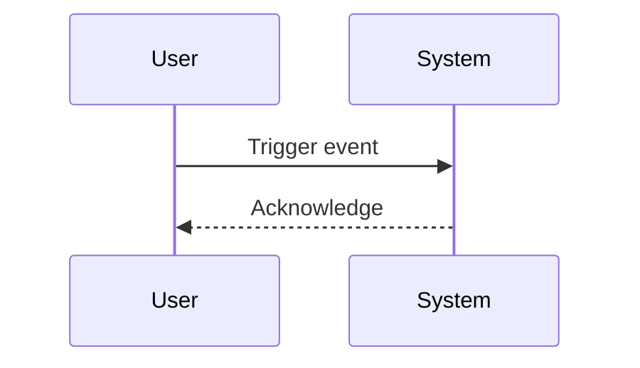

# Mermaid Test

\htmlonly

flowchart TD
  A[Start] --> B{Condition}
  B -- Yes --> C[Do X]
  B -- No  --> D[Do Y]
  C --> E[End]
  D --> E[End]

\endhtmlonly

```mermaid
sequenceDiagram
  participant User
  participant System
  User->>System: Trigger event
  System-->>User: Acknowledge
```
